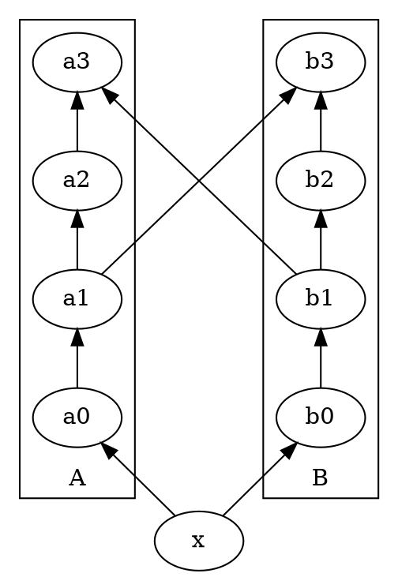
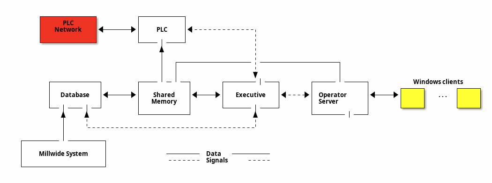

+++
title = "Org Babel"
date = 2019-10-31T22:01:00+08:00
lastmod = 2022-12-14T21:23:07+08:00
tags = ["emacs", "org"]
categories = ["技术"]
draft = false
+++

Emacs 的 Org-mode 功能非常强大，利用 org-bable 可以实现文学编程。 <br/>

<!--more-->


## 支持的语言 {#支持的语言}

| Language      | Identifier        |
|---------------|-------------------|
| Apache Groovy | groovy            |
| AWK           | awk               |
| C             | C                 |
| C++           | cpp               |
| Calc          | calc              |
| CLI           | shell             |
| Clojure       | clojure           |
| Comint mode   | comint            |
| CSS           | css               |
| D             | D                 |
| ditaa         | ditaa             |
| Emacs Lisp    | emacs-lisp, elisp |
| Eshell        | eshell            |
| Fortran       | F90               |
| Gforth        | forth             |
| Gnuplot       | gnuplot           |
| GNU Screen    | screen            |
| GNU sed       | sed               |
| Graphviz      | dot               |
| Haskell       | haskell           |
| Java          | java              |
| Julia         | julia             |
| LaTeX         | latex             |
| LilyPond      | lilypond          |
| Lisp          | lisp              |
| Lua           | lua               |
| Make          | makefile          |
| MATLAB®       | matlab            |
| Maxima        | max               |
| Node.js       | js                |
| OCaml         | ocaml             |
| Octave        | octave            |
| Org mode      | org               |
| Perl          | perl              |
| PlantUML      | plantuml          |
| Processing    | processing        |
| Python        | python            |
| R             | R                 |
| Ruby          | ruby              |
| Sass          | sass              |
| Scheme        | scheme            |
| SQL           | sql               |
| SQLite        | sqlite            |

更多、更新的文档，可参考 <https://orgmode.org/worg/org-contrib/babel/languages/index.html>


## 我的配置 {#我的配置}

```emacs-lisp
  (org-babel-do-load-languages
   'org-babel-load-languages
   '((C . t)
     (calc . t)
     (clojure . t)
     (dot . t)
     (ein . t)
     (emacs-lisp . t)
     (gnuplot . t)
     (java . t)
     (js . t)
     (latex . t)
     (lilypond . t)
     (lisp . t)
     (lua . t)
     (org . t)
     (perl . t)
     (plantuml . t)
     (python . t)
     (restclient . t)
     (ruby . t)
     (shell . t)))
```


## 例子 {#例子}


### C {#c}

用 `C-c C-v v` 或 `C-c '`  查看源码。
用 `C-c C-c` 得到结果。

```C
  printf("Hello World!");
```

```text
Hello World!
```

亦即:

```C
  #include "stdlib.h"
  int main(int argc, char **argv) {
    printf("Hello World!");
    exit(0);
  }
```

```text
Hello World!
```


### C++ {#c-plus-plus}

用 `:includes` 包含头文件。

```C++
  std::cout << "Hello World!";
```

```text
Hello World!
```

亦即:

```C++
  #include <iostream>
  int main(int argc, char **argv) {
    std::cout << "Hello World!";
    exit(0);
  }
```

```text
Hello World!
```


### calc {#calc}

```calc
  fsolve(x*2=4,x)
```

```text
x = 2
```

```calc
  fsolve([x+y=a, x-y=b], [x, y])
```

```text
[x = a + (b - a) / 2, y = (a - b) / 2]
```


### clojure {#clojure}

```clojure
(ns hello
  (:require [clojure.string :as str]))

(defn say [s1, s2]
  (str (str/capitalize s1) " " (str/capitalize s2) "!"))

(println (say "hello" "world"))
```

```text
Hello World!
```


### emacs-lisp {#emacs-lisp}

```emacs-lisp
  (message "Hello World!")
```

```text
Hello World!
```


### <span class="org-todo todo TODO">TODO</span> gnuplot {#gnuplot}


### graphviz {#graphviz}





用 `C-c C-c` 生成图像。
用 `C-c C-x C-v` 查看图像。


### ipython {#ipython}

```ipython
  def foo(x):
    return x + 9

  [foo(x) + 7 for x in range(7)]
```

```text
: [16, 17, 18, 19, 20, 21, 22]
```

```ipython
  %matplotlib inline
  import matplotlib.pyplot as plt
  import numpy as np
  plt.hist(np.random.randn(20000), bins=200)
```

```text
  (array([  1.,   0.,   0.,   0.,   0.,   0.,   0.,   0.,   0.,   0.,   0.,
  0.,   1.,   0.,   0.,   0.,   0.,   0.,   0.,   0.,   0.,   0.,
  0.,   4.,   0.,   0.,   0.,   0.,   1.,   2.,   1.,   3.,   1.,
  3.,   0.,   2.,   1.,   5.,   3.,   0.,   4.,   6.,   6.,  11.,
  6.,   7.,  11.,  10.,  10.,  12.,  17.,  25.,  22.,  18.,  32.,
  26.,  27.,  31.,  27.,  35.,  38.,  36.,  40.,  56.,  57.,  51.,
  59.,  51.,  74.,  66.,  68.,  79.,  78.,  99.,  90., 115., 135.,
  120., 124., 134., 146., 148., 193., 165., 172., 203., 185., 219.,
  221., 255., 215., 225., 220., 248., 250., 278., 267., 273., 320.,
  278., 283., 303., 287., 308., 290., 339., 316., 275., 320., 356.,
  328., 311., 323., 348., 340., 343., 313., 334., 344., 320., 303.,
  300., 299., 295., 299., 285., 266., 252., 244., 242., 234., 223.,
  234., 235., 207., 194., 209., 178., 161., 156., 173., 169., 144.,
  155., 134., 117., 115., 104.,  99.,  91.,  88.,  77.,  64.,  75.,
  76.,  59.,  68.,  63.,  48.,  37.,  31.,  29.,  31.,  30.,  26.,
  26.,  26.,  22.,  25.,  13.,  19.,  16.,  14.,  12.,  16.,  13.,
  9.,   7.,   5.,   7.,   5.,   6.,   5.,   8.,   2.,   6.,   2.,
  0.,   4.,   1.,   1.,   0.,   0.,   0.,   2.,   3.,   0.,   1.,
  1.,   1.]),
  array([-4.59397338, -4.55270159, -4.5114298 , -4.47015801, -4.42888623,
  -4.38761444, -4.34634265, -4.30507087, -4.26379908, -4.22252729,
  -4.1812555 , -4.13998372, -4.09871193, -4.05744014, -4.01616836,
  -3.97489657, -3.93362478, -3.89235299, -3.85108121, -3.80980942,
  -3.76853763, -3.72726584, -3.68599406, -3.64472227, -3.60345048,
  -3.5621787 , -3.52090691, -3.47963512, -3.43836333, -3.39709155,
  -3.35581976, -3.31454797, -3.27327619, -3.2320044 , -3.19073261,
  -3.14946082, -3.10818904, -3.06691725, -3.02564546, -2.98437367,
  -2.94310189, -2.9018301 , -2.86055831, -2.81928653, -2.77801474,
  -2.73674295, -2.69547116, -2.65419938, -2.61292759, -2.5716558 ,
  -2.53038402, -2.48911223, -2.44784044, -2.40656865, -2.36529687,
  -2.32402508, -2.28275329, -2.2414815 , -2.20020972, -2.15893793,
  -2.11766614, -2.07639436, -2.03512257, -1.99385078, -1.95257899,
  -1.91130721, -1.87003542, -1.82876363, -1.78749185, -1.74622006,
  -1.70494827, -1.66367648, -1.6224047 , -1.58113291, -1.53986112,
  -1.49858933, -1.45731755, -1.41604576, -1.37477397, -1.33350219,
  -1.2922304 , -1.25095861, -1.20968682, -1.16841504, -1.12714325,
  -1.08587146, -1.04459968, -1.00332789, -0.9620561 , -0.92078431,
  -0.87951253, -0.83824074, -0.79696895, -0.75569717, -0.71442538,
  -0.67315359, -0.6318818 , -0.59061002, -0.54933823, -0.50806644,
  -0.46679465, -0.42552287, -0.38425108, -0.34297929, -0.30170751,
  -0.26043572, -0.21916393, -0.17789214, -0.13662036, -0.09534857,
  -0.05407678, -0.012805  ,  0.02846679,  0.06973858,  0.11101037,
  0.15228215,  0.19355394,  0.23482573,  0.27609752,  0.3173693 ,
  0.35864109,  0.39991288,  0.44118466,  0.48245645,  0.52372824,
  0.56500003,  0.60627181,  0.6475436 ,  0.68881539,  0.73008717,
  0.77135896,  0.81263075,  0.85390254,  0.89517432,  0.93644611,
  0.9777179 ,  1.01898969,  1.06026147,  1.10153326,  1.14280505,
  1.18407683,  1.22534862,  1.26662041,  1.3078922 ,  1.34916398,
  1.39043577,  1.43170756,  1.47297934,  1.51425113,  1.55552292,
  1.59679471,  1.63806649,  1.67933828,  1.72061007,  1.76188186,
  1.80315364,  1.84442543,  1.88569722,  1.926969  ,  1.96824079,
  2.00951258,  2.05078437,  2.09205615,  2.13332794,  2.17459973,
  2.21587151,  2.2571433 ,  2.29841509,  2.33968688,  2.38095866,
  2.42223045,  2.46350224,  2.50477402,  2.54604581,  2.5873176 ,
  2.62858939,  2.66986117,  2.71113296,  2.75240475,  2.79367654,
  2.83494832,  2.87622011,  2.9174919 ,  2.95876368,  3.00003547,
  3.04130726,  3.08257905,  3.12385083,  3.16512262,  3.20639441,
  3.24766619,  3.28893798,  3.33020977,  3.37148156,  3.41275334,
  3.45402513,  3.49529692,  3.53656871,  3.57784049,  3.61911228,
  3.66038407]),
  <a list of 200 Patch objects>)
```




### java {#java}

```java
  public class HelloWorld {
      public static void main(String[] args) {
          System.out.println("Hello World!");
      }
  }
```

```text
Hello World!
```


### <span class="org-todo todo TODO">TODO</span> javascript {#javascript}


### latex {#latex}

```latex
   \begin{equation}
   \Pr(X_t=j|X_{t-1}=i) = \frac{j(j-1)}{2}\Big(\frac{i}{N}\Big)^j\Big(\frac{N-i}{N}\Big)^{n-j}
   \end{equation}
```


### <span class="org-todo todo TODO">TODO</span> lisp {#lisp}


### <span class="org-todo todo TODO">TODO</span> org {#org}


### perl {#perl}

```perl
  print "Hello World!\n";
```

```text
Hello World!
```


### plantuml {#plantuml}

用 `:cmdline -charset utf-8` 避免乱码:

```plantuml
  爱丽丝 -> 鲍勃: 实线箭头
  爱丽丝 ->> 鲍勃: 实线空心箭头
  鲍勃 --> 爱丽丝: 虚线箭头
  爱丽丝 -\ 鲍勃: 半箭头
  爱丽丝 /-- 鲍勃: 虚线半箭头
  爱丽丝 \\-- 鲍勃: 虚线空心半箭头
  爱丽丝 ->o 鲍勃: 圆形+箭头
  爱丽丝 <-> 鲍勃: 双向箭头
```



目前的 plantuml 可以支持 ditaa 的语法，因此将原 ditaa 的例子改写成 plantuml：






### python {#python}

```python
print("Hello World!")
```

```text
Hello World!
```

```python
import matplotlib, numpy
matplotlib.use('Agg')
import matplotlib.pyplot as plt
fig=plt.figure(figsize=(4,2))
x=numpy.linspace(-15,15)
plt.plot(numpy.sin(x)/x)
fig.tight_layout()
plt.savefig('images/python.png')
return 'images/python.png'
```




### restclient {#restclient}

```restclient
GET https://api.github.com
User-Agent: Emacs Restclient
```

```js
{
  "current_user_url": "https://api.github.com/user",
  "current_user_authorizations_html_url": "https://github.com/settings/connections/applications{/client_id}",
  "authorizations_url": "https://api.github.com/authorizations",
  "code_search_url": "https://api.github.com/search/code?q={query}{&page,per_page,sort,order}",
  "commit_search_url": "https://api.github.com/search/commits?q={query}{&page,per_page,sort,order}",
  "emails_url": "https://api.github.com/user/emails",
  "emojis_url": "https://api.github.com/emojis",
  "events_url": "https://api.github.com/events",
  "feeds_url": "https://api.github.com/feeds",
  "followers_url": "https://api.github.com/user/followers",
  "following_url": "https://api.github.com/user/following{/target}",
  "gists_url": "https://api.github.com/gists{/gist_id}",
  "hub_url": "https://api.github.com/hub",
  "issue_search_url": "https://api.github.com/search/issues?q={query}{&page,per_page,sort,order}",
  "issues_url": "https://api.github.com/issues",
  "keys_url": "https://api.github.com/user/keys",
  "label_search_url": "https://api.github.com/search/labels?q={query}&repository_id={repository_id}{&page,per_page}",
  "notifications_url": "https://api.github.com/notifications",
  "organization_url": "https://api.github.com/orgs/{org}",
  "organization_repositories_url": "https://api.github.com/orgs/{org}/repos{?type,page,per_page,sort}",
  "organization_teams_url": "https://api.github.com/orgs/{org}/teams",
  "public_gists_url": "https://api.github.com/gists/public",
  "rate_limit_url": "https://api.github.com/rate_limit",
  "repository_url": "https://api.github.com/repos/{owner}/{repo}",
  "repository_search_url": "https://api.github.com/search/repositories?q={query}{&page,per_page,sort,order}",
  "current_user_repositories_url": "https://api.github.com/user/repos{?type,page,per_page,sort}",
  "starred_url": "https://api.github.com/user/starred{/owner}{/repo}",
  "starred_gists_url": "https://api.github.com/gists/starred",
  "user_url": "https://api.github.com/users/{user}",
  "user_organizations_url": "https://api.github.com/user/orgs",
  "user_repositories_url": "https://api.github.com/users/{user}/repos{?type,page,per_page,sort}",
  "user_search_url": "https://api.github.com/search/users?q={query}{&page,per_page,sort,order}"
}

// GET https://api.github.com
// HTTP/1.1 200 OK
// date: Wed, 21 Oct 2020 10:51:06 GMT
// server: GitHub.com
// status: 304 Not Modified
// cache-control: public, max-age=60, s-maxage=60
// vary: Accept, Accept-Encoding, Accept, X-Requested-With, Accept-Encoding
// access-control-expose-headers: ETag, Link, Location, Retry-After, X-GitHub-OTP, X-RateLimit-Limit, X-RateLimit-Remaining, X-RateLimit-Used, X-RateLimit-Reset, X-OAuth-Scopes, X-Accepted-OAuth-Scopes, X-Poll-Interval, X-GitHub-Media-Type, Deprecation, Sunset
// access-control-allow-origin: *
// strict-transport-security: max-age=31536000; includeSubdomains; preload
// x-frame-options: deny
// x-content-type-options: nosniff
// x-xss-protection: 1; mode=block
// referrer-policy: origin-when-cross-origin, strict-origin-when-cross-origin
// content-security-policy: default-src 'none'
// content-type: application/json; charset=utf-8
// x-github-media-type: github.v3; format=json
// ETag: W/"27278c3efffccc4a7be1bf315653b901b14f2989b2c2600d7cc2e90a97ffbf60"
// X-Ratelimit-Limit: 60
// X-Ratelimit-Remaining: 57
// X-Ratelimit-Reset: 1603281000
// X-Ratelimit-Used: 3
// Accept-Ranges: bytes
// Content-Length: 2308
// X-GitHub-Request-Id: F488:302F:38FC8F3:450393D:5F901276
// Request duration: 0.270389s
```


### <span class="org-todo todo TODO">TODO</span> ruby {#ruby}


### <span class="org-todo todo TODO">TODO</span> shell {#shell}
