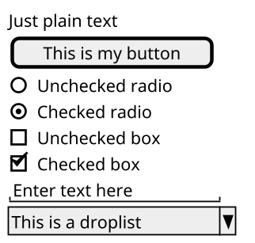
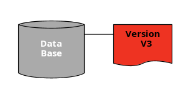
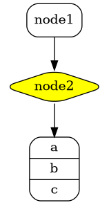
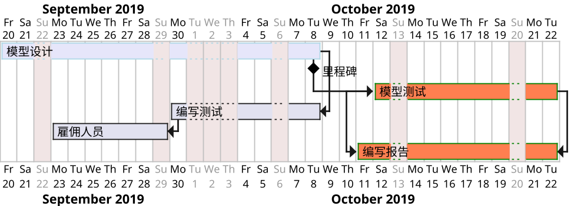
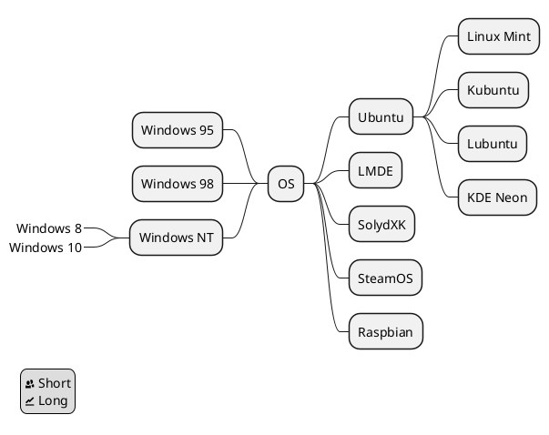

+++
title = "PlantUML in Emacs"
date = 2019-11-18T19:59:00+08:00
lastmod = 2022-05-02T11:00:04+08:00
tags = ["emacs", "org", "plantuml"]
categories = ["技术"]
draft = false
+++

PlantUML 支持绘制各类图标。本文选几个自己用得到的做一些简单介绍。 <br/>

完整的例子见 <http://plantuml.com/zh/index> <br/>

<!--more-->


## 通用命令 {#通用命令}

-   注释 <br/>

    所有以 单引号 `'` 开头的语句，被认为是一个注释。 <br/>
    多行注释，以 `/'` 和 `'/` 作为注释的开始和结束。 <br/>
-   页眉和页脚 <br/>

    用 `header` 和 `footer` 命令在生成的图中增加页眉和页脚。 <br/>
    选择指定 `center`​、​`left` 或 `right` 关键字使页眉或页脚实现居中、左对齐和右对齐。 <br/>
-   缩放用 `scale` 关键词。 <br/>

    | 例子                 |
    |--------------------|
    | scale 1.5            |
    | scale 2/3            |
    | scale 200 width      |
    | scale 200 height     |
    | scale 200\*100       |
    | scale max 300\*200   |
    | scale max 1024 width |
    | scale max 800 height |
-   标题 <br/>

    使用 `title` 关键字添加标题。在标题描述中使用 `\n` 添加新行。 <br/>
-   图片标题 <br/>

    使用 `caption` 关键字在图像下放置一个标题。 <br/>
-   图例说明 <br/>

    用 `legend` 和 `end legend` 作为关键词，用于配置一个图例。支持可选地使用 `left`​、​`right`​、​`center` 为这个图例指定对齐方式。 <br/>


## 时序图 {#时序图}

```plantuml
autonumber
header 页眉
footer 第 %page% 页，共 %lastpage% 页
title 标题示例
actor Foo1
boundary Foo2
control Foo3
entity Foo4
database Foo5
collections Foo6
Foo1 -> Foo2 : To boundary
note left: this note is left to all
note right of Foo1: this note is right to Foo1
alt One
        Foo1 --> Foo3 : To control
        note over Foo3: this note is over Foo3
        == 阶段 II ==
        Foo1 -\ Foo4 : To entity
else Two
        note over Foo3, Foo4 #FFAAAA: This is a colored note\n and over Foo3 & Foo4.
        loop 1000 times
                Foo1 <-> Foo5 : To database
                ...5 minutes latter...
                |||
                autonumber 1005
        end
        Foo1 -/ Foo6 : To collections
        note right: this is the last note
end
```

 <br/>

注解： <br/>

-   `autonumber` 用来给消息序列自动编号，​`autonumber N` 用于指定起始编号为 `N`​，​`autonumber N x` 指定起始编号 `N` 与增量 `x`​。用 `autonumber stop/resume` 来暂停/继续编号。 <br/>
-   可以指定参与者：​`actor`​、​`boundary`​、​`control`​、​`entity`​、​`database` 等。 <br/>
-   改变箭头格式：​`->x` 表示丢失的箭头，​`->o` 表示带圈的箭头，​`-/` 或 `-\` 表示半个箭头，​`-->` 表示虚线箭头，​`<->` 表示双向箭头。 <br/>
-   用 `title`​，​`header`​，​`footer` 来定义标题、页眉、页脚。 <br/>
-   在消息后面添加 `note left`​、​`note right` 关键词来给消息添加注释。用 `note left of`​、​`note right of` 或 `note over` 在节点的相对位置放置注释。 <br/>
-   通过以下关键词将消息分组：​`alt/else`​、​`opt`​、​`loop`​、​`par`​、​`break`​、​`critical`​、​`group`​，用 `end` 结束分组。 <br/>
-   使用 `==` 来分割图表，用 `...` 来表示延迟，用 `|||` 增加空间。 <br/>
-   用 `skinparam` 改变字体和颜色。 <br/>


## 用例图 {#用例图}

```plantuml
skinparam handwritten true
:长老: as E <<管理者>>
:中伴: as M <<情者>>
:左伴: as L <<理者>>
:右伴: as R <<抚育者>>
usecase Use <<main>> as "You can use
several lines to define your usecase.
You can also use separators.
--
Several separators are possible.
==
And you can add titles:
..Conclusion..
This allows large description."

M -> R
M -left-> L
M --> (联合)
E ----> (联合)
note right of E : This is an example note.
note right of (联合)
        A note can also
        be on several lines
end note
note "This note is connected\nto several objects." as N2
R .. N2
N2 .. (联合)
```

 <br/>

注解： <br/>

-   用例用圆括号括起来，也可以用关键字 `usecase` 来定义用例。还可以用关键字 `as` 定义一个别名。 <br/>
-   角色用两个冒号包裹起来，也可以用 `actor` 关键字来定义角色。还可以用关键字 `as` 来定义一个别名。 <br/>
-   定义跨越多行的用例描述，可以用双引号将其裹起来。还可以使用这些分隔符：​`--`​、​`..`​、​`==`​、​`__`​。 <br/>
-   用箭头 `-->` 连接角色和用例。横杠 `-` 越多，箭头越长。通过在箭头定义的后面加一个冒号及文字的方式来添加标签。 <br/>
-   箭头默认是竖直方向，用两杠 `-->` 表示，用单杠 `->` 表示水平方向。也可以通过给箭头添加 `left`​、​`right`​、​`up` 或 `down` 等关键字来改变方向。 <br/>
-   用 `note left of​、​=note right of`​、​`note top of`​、​`note bottom of` 等关键字给一个对象添加注释。还可以通过 `note` 关键字来定义，然后用 `..` 连接其他对象。 <br/>
-   用 `<<` `>>` 来定义角色或者用例的构造类型。 <br/>
-   用 `skinparam` 改变字体和颜色。如 `skinparam handwritten true` 采用手绘风格。 <br/>


## 类图 {#类图}

```plantuml
Object <|-- ArrayList :contains

Object : + equals()
ArrayList : ~ Object[] elementData
ArrayList : + size()
ArrayList : # add()
```

 <br/>

注解： <br/>

-   分别用 `<|--`​、​`*--`​、​`o--` 表示扩展、组合、聚合关系。用 `..` 代替--得到虚线。 <br/>
-   关系之间的标签用 `:` 表示。 <br/>
-   分别用 `-​=、​​=#`​、​`~`​、​`+` 表示 `private`​、​`protected`​、​`package private`​、​`public` 的域或方法。 <br/>


## 活动图 {#活动图}

```plantuml
start
:ClickServlet.handleRequest();
:new page;
if (Page.onSecurityCheck) then (true)
        :Page.onInit();
        if (isForward?) then (no)
                :Process controls;
                if (continue processing?) then (no)
                        stop
                endif

                if (isPost?) then (yes)
                        :Page.onPost();
                else (no)
                        :Page.onGet();
                endif
                :Page.onRender();
        endif
else (false)
endif

if (do redirect?) then (yes)
        :redirect process;
else
        if (do forward?) then (yes)
                :Forward request;
        else (no)
                :Render page template;
        endif
endif

end
```

 <br/>

注解： <br/>

-   活动标签以冒号开始，以分号结束。 <br/>
-   用关键字 `start` 和 `stop` （也可以使用 `end` ）表示图示的开始和结束。 <br/>
-   用关键字 `if`​、​`then` 和 `else` 设置分支测试。标注文字则放在括号中。用关键字 `elseif` 设置多个分支测试。 <br/>
-   用关键字 `repeat` 和 `repeatwhile` 进行重复循环。 <br/>
-   用关键字 `while` 和 `end while` 进行 `while` 循环。 <br/>
-   用关键字 `fork`​、​`fork again` 和 `end fork` 表示并行处理。 <br/>


## 组件图 {#组件图}

```plantuml
package "Some Group" {
        HTTP - [First Component]
        [Another Component]
}

node "Other Groups" {
        FTP - [Second Component]
        [First Component] --> FTP
}

cloud {
        [Example 1]
}

database "MySql" {
        folder "This is my folder" {
                [Folder 3]
        }
        frame "Foo" {
                [Frame 4]
        }
}

[Another Component] --> [Example 1]
[Example 1] --> [Folder 3]
[Folder 3] --> [Frame 4]
```

 <br/>

注解： <br/>

-   组件必须用中括号 `[]` 来定义。接口用小括号 `()` 来定义。 <br/>
-   元素之间可以使用虚线 `..`​、直线 `--`​、箭头 `-->` 进行连接。 <br/>


## 状态图 {#状态图}

```plantuml
scale 350 width
[*] --> NotShooting

state NotShooting {
        [*] --> Idle
        Idle --> Configuring : EvConfig
        Configuring --> Idle : EvConfig
}

state Configuring {
        [*] --> NewValueSelection
        NewValueSelection --> NewValuePreview : EvNewValue
        NewValuePreview --> NewValueSelection : EvNewValueRejected
        NewValuePreview --> NewValueSelection : EvNewValueSaved

        state NewValuePreview {
                State1 -> State2
        }
}
```

 <br/>

注解： <br/>

-   用 `[*]` 开始和结束状态图。 <br/>
-   用 `-->` 添加箭头。默认为向右。用 `-right->`​、​`-up->`​、​`-down->` 来表示其他方向。 <br/>
-   一个状态也可能是合成的，用关键字 `state` 和花括号 `{}` 来定义合成状态。 <br/>
-   用关键字 `state` 定义长名字状态。 <br/>
-   用 `<<fork>>` and `<<join>>` 表示分支和联合状态。 <br/>
-   用 `--` 或 `||` 作为分隔符来合成并发状态。 <br/>
-   用 `note left of`​、​`note right of`​、​`note top of`​、​`note bottom of` 关键字来定义注释。 <br/>


## 定时图 {#定时图}

```plantuml
robust "DNS Resolver" as DNS
robust "Web Browser" as WB
concise "Web User" as WU

@0
WU is Idle
WB is Idle
DNS is Idle

@+100
WU -> WB : URL
WU is Waiting
WB is Processing

@+200
WB is Waiting
WB -> DNS@+50 : Resolve URL

@+100
DNS is Processing

@+300
DNS is Idle
```

 <br/>

注解： <br/>

-   用 `concise` 或 `robust` 关键字声明参与者, 选择哪个取决于所需的显示样式。 <br/>
-   用 `@` 表示相对时间。 <br/>


## 部署图 {#部署图}

```plantuml
actor actor
agent agent
artifact artifact
boundary boundary
card card
cloud cloud
component component
control control
database database
entity entity
file file
folder folder
frame frame
interface  interface
node node
package package
queue queue
stack stack
rectangle rectangle
storage storage
usecase usecase

folder folderA [
这是一个 <b>文件夹
----
您可以使用
====
不同类型
....
的分隔符
]

node nodeA [
这是一个 <b>结点
----
您可以使用
====
不同类型
....
的分隔符
]

database databaseA [
这是个数据库 <b>数据库
----
您可以使用
====
不同类型
....
的分隔符
]

usecase usecaseA [
这是个 <b>用例
----
您可以使用
====
不同类型
....
的分隔符
]
```

 <br/>

注解： <br/>

-   用关键词声明元素。用方括号 `[]` 放置长描述文本。 <br/>
-   用 `--`​、​`~~`​、​`==` 创建连接。 <br/>


## 架构图 {#架构图}

```plantuml
sprite $bProcess jar:archimate/business-process
sprite $aService jar:archimate/application-service
sprite $aComponent jar:archimate/application-component

archimate #Business "Handle claim"  as HC <<business-process>>
archimate #Business "Capture Information"  as CI <<business-process>>
archimate #Business "Notify\nAdditional Stakeholders" as NAS <<business-process>>
archimate #Business "Validate" as V <<business-process>>
archimate #Business "Investigate" as I <<business-process>>
archimate #Business "Pay" as P <<business-process>>

HC *-down- CI
HC *-down- NAS
HC *-down- V
HC *-down- I
HC *-down- P

CI -right->> NAS
NAS -right->> V
V -right->> I
I -right->> P

archimate #APPLICATION "Scanning" as scanning <<application-service>>
archimate #APPLICATION "Customer admnistration" as customerAdministration <<application-service>>
archimate #APPLICATION "Claims admnistration" as claimsAdministration <<application-service>>
archimate #APPLICATION Printing  <<application-service>>
archimate #APPLICATION Payment  <<application-service>>

scanning -up-> CI
customerAdministration  -up-> CI
claimsAdministration -up-> NAS
claimsAdministration -up-> V
claimsAdministration -up-> I
Payment -up-> P

Printing -up-> V
Printing -up-> P

archimate #APPLICATION "Document\nManagement\nSystem" as DMS <<application-component>>
archimate #APPLICATION "General\nCRM\nSystem" as CRM <<application-component>>
archimate #APPLICATION "Home & Away\nPolicy\nAdministration" as HAPA <<application-component>>
archimate #APPLICATION "Home & Away\nFinancial\nAdministration" as HFPA <<application-component>>

DMS .up.|> scanning
DMS .up.|> Printing
CRM .up.|> customerAdministration
HAPA .up.|> claimsAdministration
HFPA .up.|> Payment

legend left
        Example from the "Archisurance case study" (OpenGroup).
        See
        ==
        <$bProcess> :business process
        ==
        <$aService> : application service
        ==
        <$aComponent> : application component
endlegend
```

 <br/>

注释： <br/>

-   用 `archmate` 关键词定义元素。 <br/>
-   用 `circle` 关键词定义连接。 <br/>


## 线框图 {#线框图}



 <br/>

注释： <br/>

-   用 `{}` 定义一个窗体。 <br/>
-   用 `[]` 定义按钮。 <br/>
-   用 `()` 定义单选按钮。 <br/>
-   用 `[]` 定义复选按钮。 <br/>
-   用 `""` 定义文本域。 <br/>
-   用 `^^` 定义下拉菜单。 <br/>


## Ditaa {#ditaa}



 <br/>

注解： <br/>

-   通用规则允许图表描述以 `@startXXX` 开头，以 `@endXXX` 结束，"XXX"根据图表的类型而改变。目前新版的 plantuml 可以支持 ditaa 了。 <br/>
-   可以在 `@startditaa` 关键字后面使用一些设置：​`-E` 或者 `--no-separation` 移除分隔符，​`-S` 或者 `--no-shadows` 移除阴影，​`scale=x` 缩放图表。 <br/>


## Dot {#dot}



 <br/>

注解： <br/>

-   和上面一样的原因，目前在 plantuml 中可以使用 Graphviz/DOT 了。使用的是 Graphviz 的语法。 <br/>


## 甘特图 {#甘特图}



 <br/>

注解： <br/>

-   任务名称用中括号 `[]` 来定义，还可以用关键词 `as` 来定义缩写。 <br/>
-   任务时长用 `lasts` 来定义。 <br/>
-   里程碑用 `happens` 来定义。 <br/>
-   可以定义日期，还可以按照星期、日期、日期范围关闭日期。 <br/>


## 思维导图 {#思维导图}



 <br/>

注解： <br/>

-   plantuml 的 mindmap 兼容 org-mode 的语法，即用不同数量的 `*` 表示不同的层级。但在 org-babel 中由于受到其他因素影响，故用 `+`​、​`-` 代替。其中 `+` 表示向右展开， `-` 表示向左展开。 <br/>
-   用下划线 `_` 可以取消边框。 <br/>
